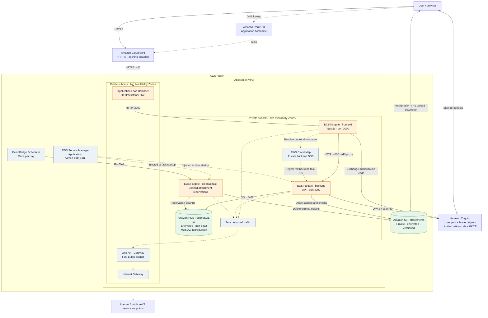
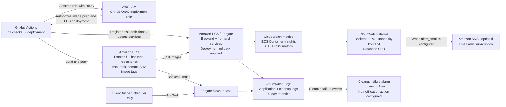

# AWS infrastructure diagram

This diagram describes the checked-in Terraform and application code, not a live AWS inventory. Resource names and region are parameterized. Mermaid diagrams render on GitHub and can be edited as text.

## Application and network

Solid arrows show application traffic or task execution. Dotted arrows show DNS, configuration, or the shared outbound network route. Connections to regional AWS services are logical connections; task access to public endpoints uses NAT when Terraform creates the network.

- **Networking:** `create_network = true` creates two public and two private subnets across two Availability Zones, with a single NAT Gateway. Otherwise, Terraform uses supplied VPC, subnet, and ECS security group IDs. Tasks have no public IPs. The diagram groups subnets; it does not imply a task is running in every zone.
- **Availability:** production requests two frontend tasks, two backend tasks, and Multi-AZ RDS. Other environments request one task per service and single-AZ RDS.
- **Ingress:** CloudFront forwards to the public ALB over HTTPS. Existing ACM certificates are supplied for CloudFront in `us-east-1` and the ALB in its region. The ALB security group permits public port 443; it is not restricted to CloudFront. Frontend port 3000 accepts the ALB security group; backend port 4000 accepts the shared ECS security group. RDS port 5432 also accepts that shared ECS security group.
- **Attachments:** the API authorizes access and returns presigned URLs; the browser transfers attachment bytes directly to S3. S3 blocks public access, requires TLS, and retains noncurrent object versions for 90 days under `groups/`.
- **Secrets and roles:** the ECS execution role injects the application database secret, pulls images, and writes logs. Backend and cleanup tasks share a runtime role with scoped attachment access. RDS separately manages its administrator password in Secrets Manager; the application secret is populated outside Terraform.
- **Optional email:** application code supports Amazon SES invitations, but the current Terraform does not provision the SES sender identity, email DNS records, runtime permission, or sender environment setting. SES is therefore omitted from the provisioned-service diagram.

## Deployment and operations

The deployment workflow runs on pushes to `main` or manual dispatch, passes CI, and deploys the backend followed by the frontend. The GitHub IAM role is created when `github_repository` is set. The cleanup task definition and schedule are managed by Terraform; the application deployment workflow does not update the cleanup image.

## Source files

| Area | Source |
| --- | --- |
| VPC, subnets, routing, NAT | [network.tf](terraform/network.tf) |
| Load balancer and ingress | [alb.tf](terraform/alb.tf) |
| CloudFront and DNS | [route53_cloudfront.tf](terraform/route53_cloudfront.tf) |
| Frontend and backend services | [ecs.tf](terraform/ecs.tf) |
| Private backend discovery | [service_discovery.tf](terraform/service_discovery.tf) |
| RDS, S3, Cognito, ECR, secrets | [main.tf](terraform/main.tf) |
| Execution and runtime permissions | [iam.tf](terraform/iam.tf) |
| Scheduled attachment cleanup | [maintenance.tf](terraform/maintenance.tf) |
| Alarms and optional email alerts | [monitoring.tf](terraform/monitoring.tf) |
| GitHub deployment permissions | [deploy.tf](terraform/deploy.tf) |
| Deployment workflow | [deploy.yml](../.github/workflows/deploy.yml) |
